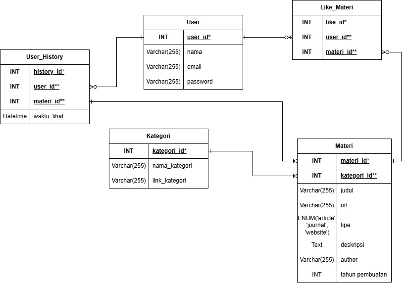

# PraktikumPemWebKelompok11
File Pemrograman Web Kelas C untuk kelompok 11 - Ekonomi Sulit, Penghasilan Sempit, HIDUUPP......!!!!!!

## Anggota Kelompok
|          Nama           |     NPM      |
|-------------------------|--------------|
| Muhammad Sunuy Habiby   | 140810250014 |
| Gibraldi Zilal Fachry   | 140810250038 |
| Azrel Sakhi Reswara     | 140810250098 |

## Fungsi
Website ini berfungsi sebagai platform edukasi digital yang menjembatani penyedia materi pembelajaran dengan individu yang ingin mengasah keterampilan mereka. Secara praktis, sistem ini memfasilitasi proses pencarian, pendaftaran, dan akses ke berbagai modul pembelajaran teknis maupun vokasional yang relevan dengan kebutuhan industri saat ini, sehingga pengguna dapat belajar secara mandiri dan terstruktur.

## Tujuan
Tujuan utama dari pengembangan website ini adalah untuk mendukung pencapaian Sustainable Development Goals (SDG) target 4.4, yaitu secara signifikan meningkatkan jumlah pemuda dan orang dewasa yang memiliki keterampilan relevan. Melalui platform ini, kami bertujuan untuk mendemokratisasi akses pendidikan berbasis skill agar masyarakat dapat lebih mudah mempersiapkan diri untuk mendapatkan pekerjaan yang layak, meningkatkan jenjang karir, atau merintis wirausaha.

## Target Pengguna
Platform ini dirancang khusus untuk menjangkau kelompok masyarakat yang membutuhkan peningkatan skill, meliputi:

    - Pencari Kerja & Lulusan Baru: Individu yang membutuhkan tambahan portofolio dan keterampilan teknis nyata untuk bersaing di dunia kerja.

    - Pekerja Profesional: Karyawan yang ingin melakukan upskilling (meningkatkan kemampuan) atau reskilling (mempelajari keahlian baru) untuk beradaptasi dengan teknologi.

    - Calon Wirausaha: Orang-orang yang membutuhkan materi praktis dan bimbingan untuk mulai membangun bisnis mereka sendiri.

## Skema Database

